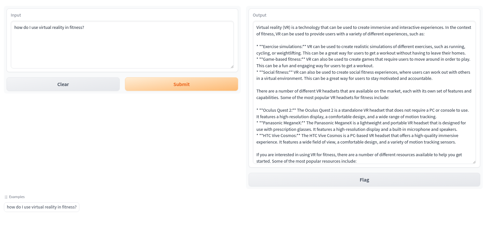

# Prediction With Custom Trained Model

This application provides a frontend for getting predictions from a custom
trained mode in Vertex AI.



## Deploying to GKE

### Setup Service Account

Compute service account is used by default. However, it's recommended to
use a separate service account for minimum permissions.

1. Enable required API

```bash
gcloud services enable compute.googleapis.com container.googleapis.com
```

2. Set the environment vars based on your environment

```bash
PROJECT_ID=<YOUR_PROJECT_ID>
EMAIL=<YOUR_USER_ACCOUNT>
REGION=<YOUR_GCP_REGION_NAME>
```

3. Set up the cluster(optional)

```shell
gcloud container clusters create demo-gke-cluster --zone ${REGION} --num-nodes 1 --project ${PROJECT_ID}

gcloud container clusters get-credentials demo-gke-cluster --zone ${REGION} --project ${PROJECT_ID}
```

4. Enable Workload Identity Federation(optional).

Note that, for GKE Autopilot clusters Workload Identity Federation is already enabled by default.

```shell

gcloud container clusters update demo-gke-cluster \
    --zone=${REGION} \
    --workload-pool=${PROJECT_ID}.svc.id.goog

gcloud container node-pools update default-pool \
    --cluster=demo-gke-cluster \
    --zone=${REGION} \
    --workload-metadata=GKE_METADATA
```

5. Create service account

```bash

gcloud iam service-accounts create test-llm \
    --description="Service account to test custom trained models" \
    --display-name="test-llm"
    
kubectl create serviceaccount test-llm-k8s-sa
```

6. Add `aiplatform.user` role

```bash


gcloud projects add-iam-policy-binding ${PROJECT_ID} \
    --member="serviceAccount:test-llm@${PROJECT_ID}.iam.gserviceaccount.com" \
    --role="roles/aiplatform.user"
```

7. Add `logging.logWriter` role

```shell
gcloud projects add-iam-policy-binding ${PROJECT_ID} \
    --member="serviceAccount:test-llm@${PROJECT_ID}.iam.gserviceaccount.com" \
    --role="roles/logging.logWriter"
```

8. Add permission to impersonate the sa (iam.serviceAccounts.actAs)

```shell
gcloud iam service-accounts add-iam-policy-binding \
    test-llm@${PROJECT_ID}.iam.gserviceaccount.com \
    --member="user:${EMAIL}" \
    --role="roles/iam.serviceAccountUser"
```

9. Authorize the GKE SA

```shell
gcloud iam service-accounts add-iam-policy-binding test-llm@${PROJECT_ID}.iam.gserviceaccount.com \
    --role roles/iam.workloadIdentityUser \
    --member "serviceAccount:${PROJECT_ID}.svc.id.goog[default/test-llm-k8s-sa]"

kubectl annotate serviceaccount test-llm-k8s-sa \
    --namespace default \
    iam.gke.io/gcp-service-account=test-llm@${PROJECT_ID}.iam.gserviceaccount.com
```

### Build

Build the docker image with Cloud Build and upload the image to Artifact
Registry.

```shell
AR_REPO=test-llm-ar
SERVICE_NAME=test-llm

gcloud artifacts repositories create ${AR_REPO} --location=$REGION --repository-format=Docker

gcloud auth configure-docker $REGION-docker.pkg.dev

gcloud builds submit --tag $REGION-docker.pkg.dev/${PROJECT_ID}/${AR_REPO}/${SERVICE_NAME}
```

### Deploy

Set the correct `image`, `project-id`, `location` and `endpoint` in pod.yaml.

Deploy the `pod.yaml`

```shell
kubectl apply -f pod.yaml
```

### Test

Use Port Forwarding to Access Applications in a Cluster

```shell
kubectl port-forward test-llm 7860:7860
```

Open the below link in your browser

```
http://127.0.0.1:7860
```